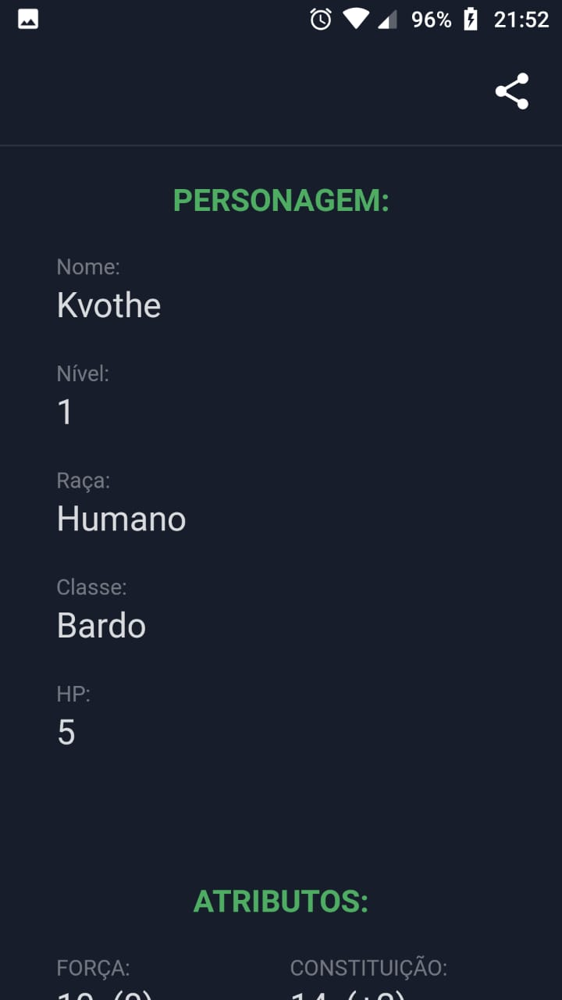
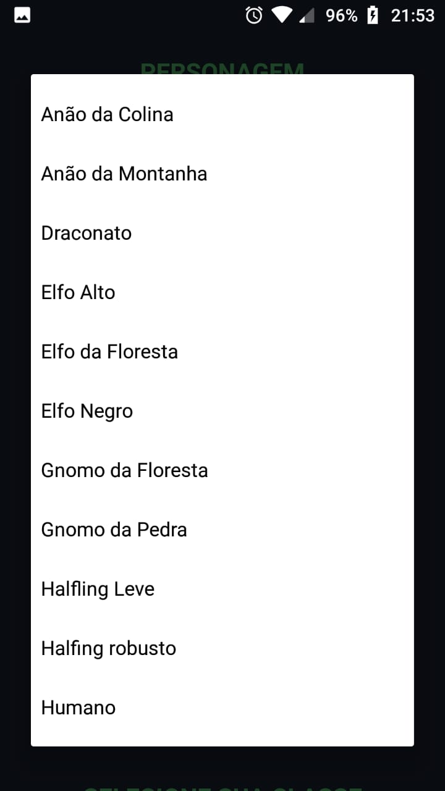
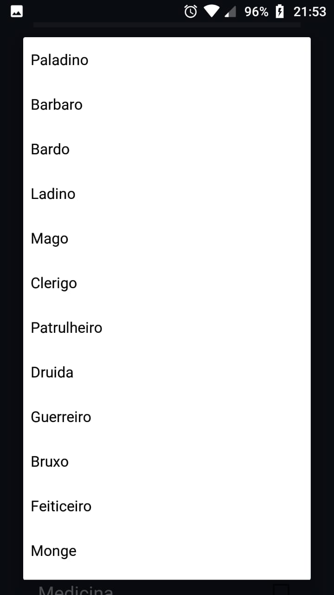

# RPGZando
RPGZando é um app desenvolvido para android com react-native.

<table>
  <tr>
    <td> </td>
    <td> </td>
    <td> </td>
  </tr>
  <tr>
    <td></td>
    <td></td>
    <td></td>
  </tr>
</table>

## Baixando
- Google Play: https://play.google.com/store/apps/details?id=com.rpgzando
- Caso queira realizar um clone do projeto unica coisa que irá precisar ter é `node`, `npm` e/ou `yarn`, `react-native cli` e `android studio` configurado. Se tiver esse pré-requisitos é apenas baixar um versão do projeto `git clone https://github.com/Luanfv/app-rpgzando.git` e rodar os seguintes comandos dentro do projeto.

`yarn` ou `npm i`
`react-native run-android`

## Desenvolvimento
O app funciona 100% offline e sem nenhuma integração com api externa, toda sua lógica e conteudo está dentro do build.

Para o desenvolvimento do app foi utilizado as libs;

- react-native-community/async-storage
- react-native-community/checkbox
- react-native-community/picker
- react-native-community/slider
- react-navigation/native
- react-navigation/stack
- react-native-modal
- react-native-vector-icons
- styled-components

## Sobre
O aplicativo foi desenvolvido com o intuito de facilidar e auxiliar o desenvolvimento de fichas de rpg de D&D 5e.

No app o usuário pode criar até 3 personagens que sera guardado no async storage e/ou compartilhar com seus contatos. Depois que o personagem for criado sera possivel visualizar a ficha ou deletar.
Os personagens terão raças, classes, pericias e atributos, sendo elas;

<table>
  <tr>
    <td> </td>
    <td> </td>
    <td> </td>
  </tr>
</table>

### Raças:
- Anão (Anão da colina, Anão da montanha)
- Draconato
- Elfo (Elfo alto, Elfo da Floresta, Elfo negro)
- Gnomo (Gnomo da floresta, Gnomo da pedra)
- Halfling (Halfling Leve, Halfling robusto)
- Humano

### Classes:
- Paladino
- Barbaro
- Bardo
- Ladino
- Mago
- Clerigo
- Patrulheiro
- Druida
- Guerreiro
- Bruxo
- Feiticeiro
- Monge

### Perícias:
- Atletismo
- Acrobacia
- Furtuvidade
- Prestidigitação
- Arcanismo
- História
- Investigação
- Natureza
- Religião
- Adestrar Animais
- Intuição
- Medicina
- Percepção
- Sobrevivência
- Atuação
- Enganação
- Intimidação
- Persuasão

### Atributos:
- Força
- Destreza
- Constituição
- Inteligencia
- Sabedoria
- Carisma
