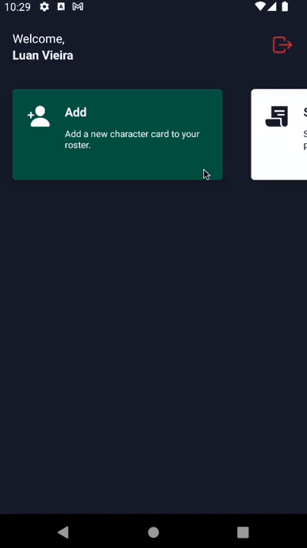

<p align="center">
  <a href="https://github.com/Luanfv/app-rpgzando">
    
  </a>

  <h1 align="center">RPGZando</h1>

  <p align="center">
    Gerenciador de fichas de RPG, desenvolvido com React-Native + TypeScript + Firebase
  </p>
  
  <div align="center">
    <a alt="Linkedin: Luan França Vieira" href="https://www.linkedin.com/in/luanfv/">
      
    </a>
    <a alt="GitHub: Luan França Vieira" href="https://github.com/Luanfv">
      
    </a>
    
    
    
    
  </div>
  
  <br />
  
  <div align="center">
    <a href="https://play.google.com/store/apps/details?id=com.rpgzando">
      
    </a>
  </div>

  <br />

  <div align="center">
    
    
  </div>

  <br />
</p>


## SOBRE O PROJETO

O RPGZando é um aplicativo para criação de fichas de RPG baseado no D&D. Através dele você poderá criar e manter suas fichas sem a necessidade de papel e caneta, facilitando o gerenciamento e mantendo o foco no que realmente importa, a campanha. Caso tenha interesse em baixar o aplicativo pela Google Play, [Clique aqui](https://play.google.com/store/apps/details?id=com.rpgzando).


## EXTENSÕES DO VSCODE

Para o desenvolvimento desse projeto é altamente recomendado que utilize o VSCode e as extensões abaixo:

- [ESLint](https://marketplace.visualstudio.com/items?itemName=dbaeumer.vscode-eslint)
- [Prettier - Code formatter](https://marketplace.visualstudio.com/items?itemName=esbenp.prettier-vscode)
- [EditorConfig for VS Code](https://marketplace.visualstudio.com/items?itemName=EditorConfig.EditorConfig)
- [vscode-styled-components](https://marketplace.visualstudio.com/items?itemName=jpoissonnier.vscode-styled-components)
- [GitLens (opcional)](https://marketplace.visualstudio.com/items?itemName=eamodio.gitlens)
- [Color Highlight (opcional)](https://marketplace.visualstudio.com/items?itemName=naumovs.color-highlight)


## INICIANDO O PROJETO

Para executar o projeto em sua maquina siga os passos abaixo. 
Obs: Os passos de `Pré-requisitos` e `Configuração do firebase` só precisam ser executados na primeira vez que for rodar o projeto.

### PRÉ-REQUISITOS

Tenha instalado e configurado em sua máquina as seguintes ferramentas: 

- [Node.js](https://nodejs.org/en/);
- [Yarn](https://yarnpkg.com/);
- [Android Studio](https://developer.android.com/studio) para utilizar o emulador do Android;
- [XCode](https://developer.apple.com/xcode/) para utilizar o emulador do iOS;
  
Obs: Caso não tenha experiência com a configuração de ambiente do React Native, [siga esta documentação](https://react-native.rocketseat.dev/).

### CONFIGURAÇÂO DO FIREBASE

É necessário fazer a configuração para conseguir conectar o projeto com o firebase.
Obs: Você pode fazer apenas a configuração da plataforma que irá utilizar.

#### ANDROID

1. Entre na pasta `/android/app` e crie um arquivo chamado `google-services.json` a partir do `google-services.example.json`.

2. Configure o json com as informações do seu projeto no firebase. 
Caso não tenha um projeto criado, crie a partir do [firebase](https://firebase.google.com/) e 
adicione o `google-services.json` no `/android/app` 
conforme informa no [react-native-firebase](https://rnfirebase.io/#2-android-setup).

Obs: Só é necessário fazer a configuração que está em `Generating Android credentials`, o [react-native-firebase](https://rnfirebase.io/).

#### IOS

1. Adicione o seu arquivo `GoogleService-Info.plist` em `/ios`.

2. Entre no arquivo `/ios/rpgzando/Info.plist` e adicione o `REVERSED_CLIENT_ID` onde estiver escrito `ios/GoogleService-Info.plist=REVERSED_CLIENT_ID`.

3. Configure o json com as informações do seu projeto no firebase. 
Caso não tenha um projeto criado, crie a partir do [firebase](https://firebase.google.com/) e 
adicione o `GoogleService-Info.plist` no `/ios` 
conforme informa no [react-native-firebase](https://rnfirebase.io/#3-ios-setup).

Obs: Só é necessário fazer a configuração que está em `Generating iOS credentials`, o [react-native-firebase](https://rnfirebase.io/).

## PADRÃO DE COMMIT

1. Selecione suas alterações
2. Realize o commit:

```bash
  # Inicia o commit
  $ yarn commit
```

3. Subir para o repositório:

```bash
  # Sobe para o repositório
  $ git push
```
